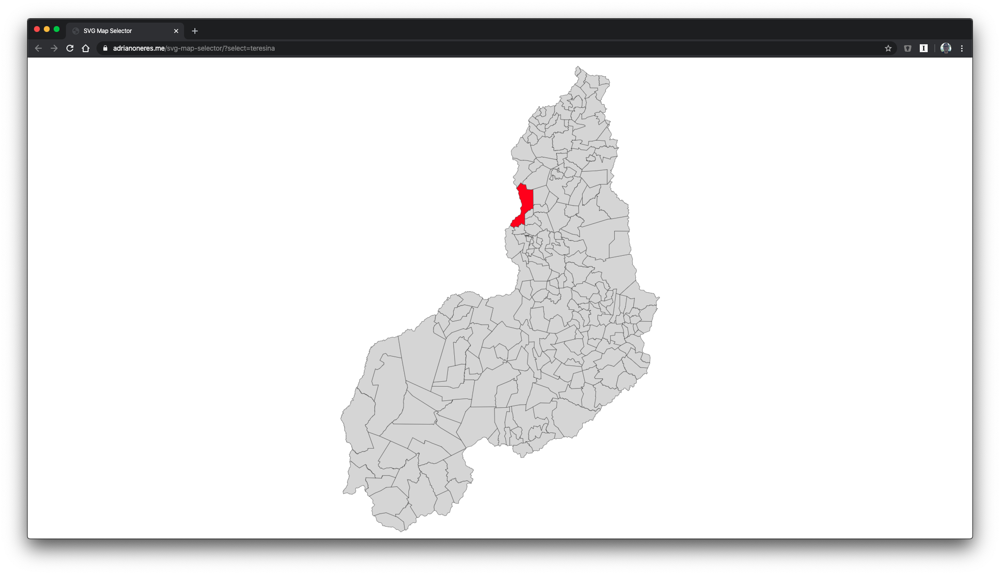

## SVG Map Selector

A small JavaScript application to select a location on a given map. 🗺

## Overview

This example is using a map from [Piauí](https://pt.wikipedia.org/wiki/Piauí), a Brazilian municipality; however, It can be personalized overriding the `assets/img/map.svg` with your own map, with proper `id` values.

- **[Demo](#demo)**
- **[How to use](#how-to-use)**
  - **[Single state with default parameters](#single-state-with-default-parameters)**
  - **[Multiple states and personalized parameters](#multiple-states-and-personalized-parameters)**
- **[Available states](#available-states)**

## Demo

- [https://adrianoneres.me/svg-map-selector?select=teresina](https://adrianoneres.me/svg-map-selector?select=teresina)

## How to use

It's all about your query params. You can search for a **[single state with default parameters](#single-state-with-default-parameters)** or for **[multiple states and personalized parameters](#multiple-states-and-personalized-parameters)**.

### Single state with default parameters

If you want to simply select one state with all default values, you can just use the name of the state as a value for the parameter `select`. Head over to [available states section](#available-states) to see all available states.

- [https://adrianoneres.me/svg-map-selector/?select=teresina](https://adrianoneres.me/svg-map-selector/?select=teresina)

### Multiple states and personalized parameters

There are all the parameters you can use to personalize your queries. All of them can be informed as complements for you `select`parameter. If you are using **one or more personalized parameter** or **more than one state** you **must** inform the parameter's label specifically.

- All of them will only work if you also inform the `states` parameter. 
- You must separate them with a semi-colon. 
- You can also append multiple `select` options. 

| Parameter       | Description                                                  | Default value | How to use                                                   |
| --------------- | ------------------------------------------------------------ | ------------- | ------------------------------------------------------------ |
| `fillColor`     | Background color on the states informed on `states` parameter | `dadada`      | The hex color without `#`. e.g.: `fillColor=00ff00`          |
| `fillOpacity`   | Opacity of the background on the states informed on `states` parameter | `1`           | Number from `0` to `1`. e.g.: `fillOpacity=0.7`              |
| `states`        | Name of the states to select                                 |               | Names of the states. If more than one, they can be separed by comma. e.g.: `states=teresina,varzea-grande` |
| `strokeColor`   | Color of the stroke on the states informed on `states` parameter | `333333`      | The hex color without `#`. e.g.: `strokeColor=0000ff`        |
| `strokeOpacity` | Opacity of the stroke on the states informed on `states` parameter | `1`           | Number from `0` to `1`. e.g.: `strokeOpacity=0.5`            |
| `strokeWidth`   | Width of the stroke on the states informed on `states` parameter | `100`         | Number. e.g.: `strokeWidth=250`                              |

There is an example of how to use multiple options on a single query:

- [https://adrianoneres.me/svg-map-selector/?select=states=teresina,varzea-grande;fillColor=b066ff;strokeWidth=300&select=baixa-grande-do-ribeiro&select=states=cristalandia-do-piaui;fillColor=ffc600;fillOpacity=0.6&select=states=dom-inocencio,canto-do-buriti;fillColor=00ff00;strokeWidth=600;strokeColor=ff00ff](https://adrianoneres.me/svg-map-selector/?select=states=teresina,varzea-grande;fillColor=b066ff;strokeWidth=300&select=baixa-grande-do-ribeiro&select=states=cristalandia-do-piaui;fillColor=ffc600;fillOpacity=0.6&select=states=dom-inocencio,canto-do-buriti;fillColor=00ff00;strokeWidth=600;strokeColor=ff00ff)

## Available states

- acaua
- agricolandia
- agua-branca
- alagoinha-do-piaui
- alegrete-do-piaui
- alto-longa
- altos
- alvorada-do-gurgueia
- amarante
- angical-do-piaui
- anisio-de-abreu
- antonio-almeida
- aroazes
- arraial
- assuncao-do-piaui
- avelino-lopes
- baixa-grande-do-ribeiro
- barra-dalcantara
- barras
- barreiras-do-piaui
- barro-duro
- batalha
- bela-vista-do-piaui
- belem-do-piaui
- beneditinos
- bertolinia
- betania-do-piaui
- boa-hora
- bocaina
- bom-jesus
- bom-principio-do-piaui
- bonfim-do-piaui
- boqueirao-do-piaui
- brazileira
- brejo-do-piaui
- buriti-dos-lopes
- buriti-dos-montes
- cabeceiras-do-piaui
- cajazeiras-do-piaui
- cajueiro-da-praia
- caldeirao-grande-do-piaui
- campinas-do-piaui
- campo-alegre-do-fidalgo
- campo-grande-do-piaui
- campo-largo-do-piaui
- campo-maior
- canavieira
- canto-do-buriti
- capitao-de-campos
- capitao-gervasio-de-oliveira
- caracol
- caraubas-do-piaui
- caridade-do-piaui
- castelo-do-piaui
- caxingo
- cocal
- cocal-de-telha
- cocal-dos-alves
- coivaras
- colonia-do-gurgueia
- colonia-do-piaui
- conceicao-do-caninde
- coronel-jose-dias
- corrente
- cristalandia-do-piaui
- cristino-castro
- curimata
- currais
- curral-novo-do-piaui
- curralinhos
- demerval-lobao
- dirceu-arcoverde
- dom-expedito-lopes
- dom-inocencio
- domingos-mourao
- elesbao-veloso
- eliseu-martins
- esperantina
- fartura-do-piaui
- flores-do-piaui
- floresta-do-piaui
- floriano
- francinopolis
- francisco-ayres
- francisco-macedo
- francisco-santos
- fronteiras
- geminiano
- gilbues
- guadalupe
- guaribas
- hugo-napoleao
- ilha-grande
- inhuma
- ipiranga-do-piaui
- isaias-coelho
- itainopolis
- itaueira
- jacobina-do-piaui
- jaicos
- jardim-do-mulato
- jatoba-do-piaui
- jerumenha
- joao-costa
- joaquim-pires
- joca-marques
- jose-de-freitas
- juazeiro-do-piaui
- julio-borges
- lagoa-alegre
- lagoa-de-sao-francisco
- lagoa-do-barro-do-piaui
- lagoa-do-piaui
- lagoa-do-sitio
- lagoinha-do-piaui
- landri-sales
- luis-correia
- luzilandia
- madeiro
- manoel-emidio
- marcolandia
- marcos-parente
- massape-do-piaui
- matias-olimpio
- miguel-alves
- miguel-leao
- milton-brandao
- monsenhor-hipolito
- monte-alegre-do-piaui
- morro-cabeca-no-tempo
- morro-do-chapeu-do-piaui
- mosenhor-gil
- murici-dos-portelas
- nazare-do-piaui
- nossa-senhora-de-nazare
- nossa-senhora-dos-remedios
- nova-santa-rita
- novo-oriente-do-piaui
- novo-santo-antonio
- oeiras
- olho-dagua-do-piaui
- padre-marcos
- paes-landim
- pajeu-do-piaui
- palmeira-do-piaui
- palmeirais
- paqueta
- parnagua
- parnaiba
- passagem-franca-do-piaui
- patos-do-piaui
- pau-darco-do-piaui
- paulistana
- pavussu
- pedro-laurentino
- pedro-li
- picos
- pimenteiras
- pio-ix
- piracuruca
- piripiri
- porto
- porto-alegre-do-piaui
- prata-do-piaui
- queimada-nova
- redencao-do-gurgueia
- regeneracao
- riacho-frio
- ribeira-do-piaui
- ribeiro-goncalves
- rio-grande-do-piaui
- santa-cruz-do-piaui
- santa-cruz-dos-milagres
- santa-filomena
- santa-luz
- santa-rosa-do-piaui
- santana-do-piaui
- santo-antonio-de-lisboa
- santo-antonio-dos-milagres
- santo-inacio-do-piaui
- sao-braz-do-piaui
- sao-felix-do-piaui
- sao-francisco-de-assis-do-piaui
- sao-francisco-do-piaui
- sao-goncalo-do-gurgueia
- sao-goncalo-do-piaui
- sao-joao-da-canabrava
- sao-joao-da-fronteira
- sao-joao-da-serra
- sao-joao-da-varjota
- sao-joao-do-arraial
- sao-joao-do-piaui
- sao-jose-do-divino
- sao-jose-do-peixe
- sao-jose-do-piaui
- sao-juliao
- sao-lourenco-do-piaui
- sao-luis-do-piaui
- sao-miguel-da-baixa-grande
- sao-miguel-do-fidalgo
- sao-miguel-tapuio
- sao-pedro-do-piaui
- sao-raimundo-nonato
- sebastiao-barros
- sebastiao-leal
- sigefredo-pacheco
- simoes
- simplicio-mendes
- socorro-do-piaui
- sussuapara
- tamboril-do-piaui
- tanque-do-piaui
- teresina
- uniao
- urucui
- valenca-do-piaui
- varzea-branca
- varzea-grande
- vera-mendes
- vila-nova-do-piaui
- wall-ferraz

